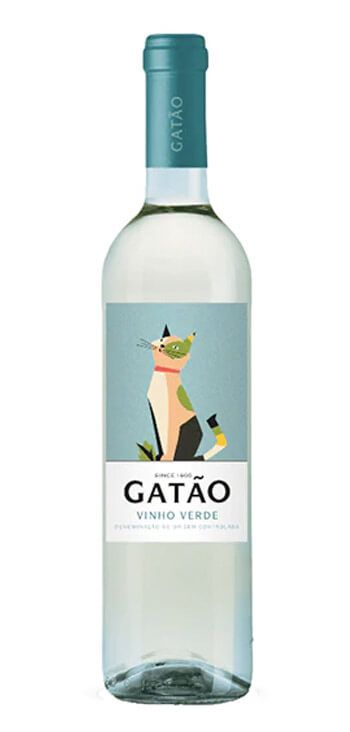

# CALIDAD DEL VINO A TRAVES DE SUS PROPIEDADES

### Mi proyecto se centrará en el vino verde, un producto único de la región del Miño (noroeste de Portugal).   

### De graduación alcohólica media, es especialmente apreciado por su frescura (especialmente en verano).   

### Este vino representa el 15% de la producción total portuguesa, y alrededor del 10% se exporta, principalmente vino blanco.   

### En este DataSet se analizan las dos variantes más comunes, blanco y rosado, de la región denominación de origen del vino verde.   

### Las muestras se analizaron en la entidad de certificación oficial (CVRVV). La CVRVV es una organización interprofesional cuyo objetivo es mejorar la calidad y la comercialización del vino verde.  

### Los datos se registraron mediante un sistema informático (iLab), que gestiona automáticamente el proceso de análisis de muestras de vino, desde la solicitud del productor hasta el análisis de laboratorio y sensorial.    

### La evaluación de la calidad suele ser parte del proceso de certificación y puede utilizarse para mejorar la elaboración del vino (identificando los factores más influyentes) y para estratificar los vinos como las marcas premium (útil para fijar precios).

## -------------------------OBJETIVO------------------------

### Con este proyecto pretendo predecir la calidad que tendrá un vino de denominación 'Vino verde' a partir de sus características Fisico-Quimicas principales.

### El target será entonces 'Quality' y el modelo se basará en la clasificadón de MALA, MEDIA O BUENA CALIDAD.

### E proyecto se subivide en las siguientes carpetas:

|-- nombre_proyecto_final_ML  
    |-- data  
    |   |-- raw  
    |        |-- dataset.csv  
    |        |-- ...  
    |   |-- processed  
    |   |-- train  
    |   |-- test  
    |  
    |-- notebooks  
    |   |-- 01_Fuentes.ipynb  
    |   |-- 02_LimpiezaEDA.ipynb  
    |   |-- 03_Entrenamiento_Evaluacion.ipynb  
    |   |-- ...  
    |  
    |-- src  
    |   |-- data_processing.py  
    |   |-- training.py  
    |   |-- evaluation.py  
    |   |-- ...  
    |  
    |-- models  
    |   |-- trained_model.pkl  
    |   |-- model_config.yaml  
    |   |-- ...  
    |  
    |-- app_streamlit  
    |   |-- app.py  
    |   |-- requirements.txt  
    |   |-- ...  
    |  
    |-- docs  
    |   |-- negocio.ppt  
    |   |-- ds.ppt  
    |   |-- memoria.md  
    |   |-- ...  
    |  
    |  
    |-- README.md  
